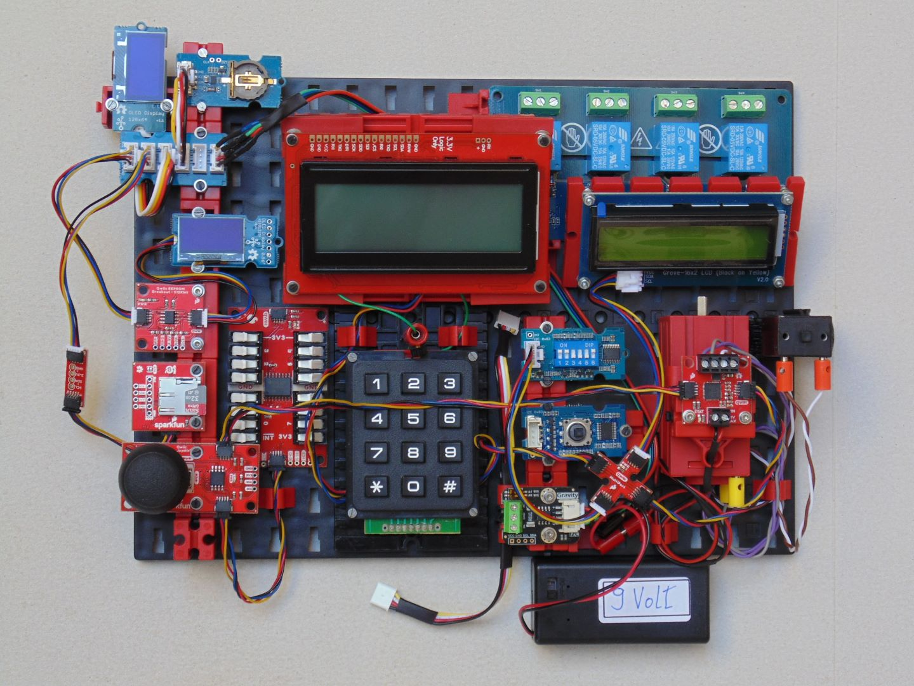
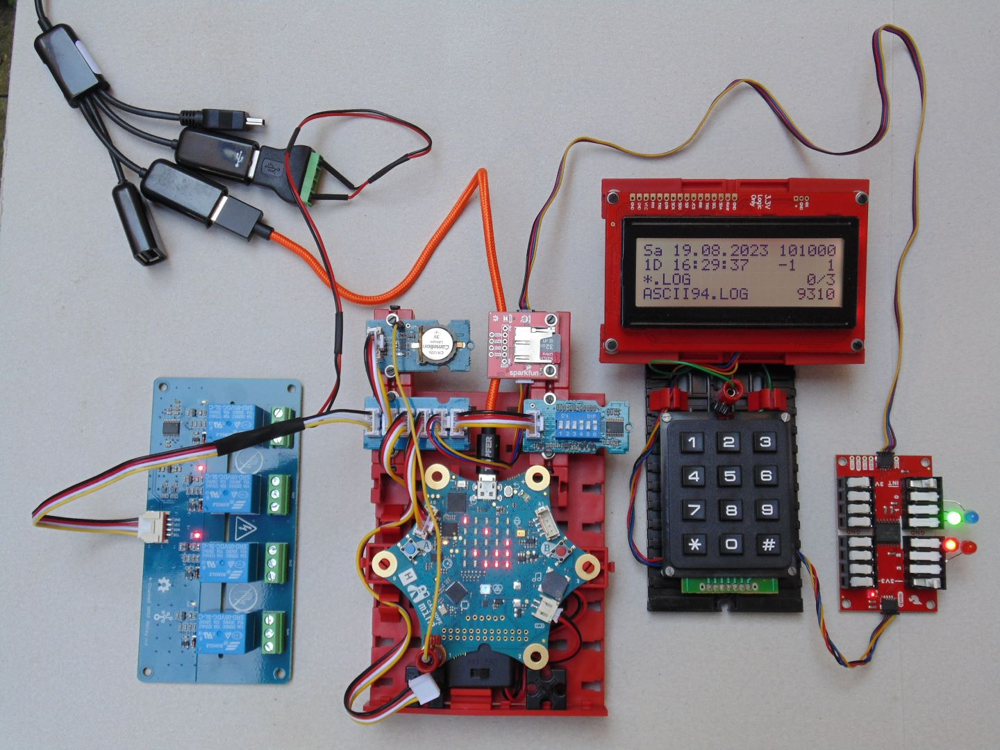
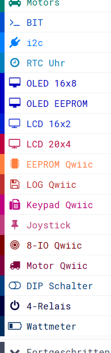
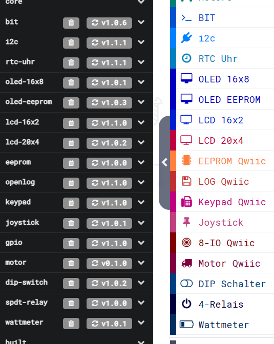

> Diese Seite bei [https://calliope-net.github.io/i2c-liste/](https://calliope-net.github.io/i2c-liste/) öffnen.

Das Bild zeigt 15 i2c Module, die alle am Calliope funktionieren und mit Blöcken programmiert werden können.
Für alle 15 Module können hier die Erweiterungen für [MakeCode](https://makecode.calliope.cc/) herunter geladen werden, 
die - genau wie die Module - beliebig miteinander kombiniert werden können.

Der linke Steckverbinder A0 am Calliope ist der i2c-Bus. An einen Bus können viele Module gleichzeitig angeschlossen werden.
Die roten Qwiic Module haben zwei Buchsen und werden einfach in beliebiger Reihenfolge hintereinander gesteckt. 
Grove-Kabel werden ebenfalls beliebig in den i2c-Hub gesteckt. Vom i2c-Hub geht nur ein Kabel zum Calliope - ohne löten - einfach anstecken.

Für das Foto wurden alle Module auf eine Grundplatte gesteckt und sichtbar mit Kabeln und Adaptern verbunden.
Wenn am 3,3 Volt i2c-Bus der Strom reichen würde, könnten alle Module gleichzeitig betrieben werden. Das wurde hier aber nicht getestet.

Getestet wurde mit 7 Modulen gleichzeitig und es hat funktioniert. Link zum Beispiel Projekt: [Calliope-i2c-App mit 7 Modulen](https://calliope-net.github.io/i2c-test/).

Wenn die Stromversorgung des Calliope über USB Kabel erfolgt, reicht das für die angeschlossenen Module (außer den 4 Relais) aus.
Die roten Qwiic Module dürfen auch nur mit 3,3V Logik betrieben werden. Im Dauerbetrieb über Tag und Nacht ist noch kein Projekt abgestürzt.

Und es ist kein teures Hobby. Über die [Bezugsquellen](#bezugsquellen) unten kosten viele Module nur um 5 € und das große Display 25 €.
Verglichen mit den in der Schule üblichen Baukästen kann das eine preiswerte Alternative sein.

### Liste der i2c Module für Calliope:

##### SparkFun - [Qwiic](https://www.sparkfun.com/categories/399) - Making I2C as easy as possible.

Produkt Dokumentation|Funktion
---|---
[SparkFun 20x4 SerLCD - RGB Backlight (Qwiic)](https://www.sparkfun.com/products/16398) | LCD-Display 20 Zeichen x 4 Zeilen
[SparkFun Qwiic EEPROM Breakout - 512Kbit](https://www.sparkfun.com/products/18355) | EEPROM 64 KByte (65536 * 8 Bit)
[SparkFun Qwiic OpenLog](https://www.sparkfun.com/products/15164) | Speicherkarte lesen/schreiben
[SparkFun Qwiic Keypad - 12 Button](https://www.sparkfun.com/products/15290) | Keypad Tasten: 0123456789*#
[SparkFun Qwiic GPIO](https://www.sparkfun.com/products/17047) | 8 digitale Ein- oder Ausgänge (Input/Output)
[SparkFun Qwiic Joystick](https://www.sparkfun.com/products/15168) | Joystick (Spielhebel)
[SparkFun Qwiic Motor Driver](https://www.sparkfun.com/products/15451) | Steuerung für 2 Motoren

##### seeed studio - [Grove](https://wiki.seeedstudio.com/Grove_System/)

Produkt Dokumentation|Funktion
---|---
[Grove - High Precision RTC (Real Time Clock)](https://wiki.seeedstudio.com/Grove_High_Precision_RTC/) | Quarz-Uhr mit Knopfzelle
[Grove - OLED Yellow&Blue Display 0.96(SSD1315)](https://wiki.seeedstudio.com/Grove-OLED-Yellow&Blue-Display-0.96-SSD1315_V1.0/) | OLED-Display 16 Zeichen x 8 Zeilen
[Grove - OLED Display 0.96 inch](https://wiki.seeedstudio.com/Grove-OLED_Display_0.96inch/) | OLED-Display 16 Zeichen x 8 Zeilen
[Grove - 16x2 LCD](https://wiki.seeedstudio.com/Grove-16x2_LCD_Series/) | LCD-Display 16 Zeichen x 2 Zeilen
[Grove - 6-Position DIP Switch](https://wiki.seeedstudio.com/Grove-6-Position_DIP_Switch/) | 6 DIP-Schalter
[Grove - 5-Way Switch](https://wiki.seeedstudio.com/Grove-5-Way_Switch/) | Taster mit 4 Richtungen + drücken
[Grove - 4-Channel SPDT Relay](https://wiki.seeedstudio.com/Grove-4-Channel_SPDT_Relay/) | 4 Relais (1-polige Umschalter)

##### DFRobot - [Gravity](https://www.dfrobot.com/gravity.html)

Produkt Dokumentation|Funktion
---|---
[Gravity: I2C Digital Wattmeter](https://www.dfrobot.com/product-1827.html) | Spannung und Strom digital messen

##### Kabel und Adapter

> Bei Qwiic Modulen ist kein Kabel dabei.

Produkt Dokumentation|Funktion
---|---
[Grove - I2C Hub(6 Port)](https://wiki.seeedstudio.com/Grove-I2C-Hub-6Port/) | i2c Hub mit 6 Grove Buchsen
[Grove - I2C Hub(4 Port)](https://wiki.seeedstudio.com/Grove-I2C_Hub/) | i2c Hub mit 4 Grove Buchsen
[Qwiic Cable - Grove Adapter](https://www.sparkfun.com/products/15109) | Grove-Stecker und Qwiic-Stecker 10 cm
[Qwiic Cable Kit](https://www.sparkfun.com/products/15081) | verschiedene Qwiic Kabel (ohne Grove-Stecker)

### Dieses Projekt von GitHub importieren, bearbeiten, mit Calliope testen.

Dieses Projekt [**calliope-net/i2c-liste**](https://github.com/calliope-net/i2c-liste) lädt alle i2c-Erweiterungen.
Die Seite mit den Blöcken ist leer und lädt sofort dazu ein, die neuen Blöcke aus den Erweiterungen zusammen zu stecken und zu testen.
[Das funktioniert mit einem Klick ](https://makecode.calliope.cc/_Hr2bxPVoYFkf)
<!--[Das funktioniert mit einem Klick ](https://makecode.calliope.cc/_CwHYcw3543C3)-->
, mit dem QR-Code oder...

 (Auf *Bearbeiten* klicken, um die Erweiterungen zu sehen.)

Um dieses Repository in MakeCode zu importieren.

* öffne [https://makecode.calliope.cc](https://makecode.calliope.cc/)
* klicke auf **Importieren** und dann auf **Importiere URL**
* kopiere die folgende **URL des Projekts** in die Zwischenablage (Strg-C)
* **calliope-net/i2c-liste**
* füge sie auf der MakeCode Webseite ein (Strg-V) und klicke auf **Los geht's!**

### Erweiterungen

Die Erweiterungen **bit** und **i2c** können ohne i2c-Modul auch im Simulator benutzt und auf Calliope geladen werden.

Erweiterung für MakeCode|zusätzliche Blöcke
---|---
[calliope-net/bit](https://calliope-net.github.io/bit/) | Blöcke für HEX-Zahlen, bitweise Logik
[calliope-net/i2c](https://calliope-net.github.io/i2c/) | Blöcke für *Buffer*, i2c Programmierung

#### Erweiterungen für i2c Hardware-Module

Erweiterung für MakeCode|Blöcke zur Programmierung der i2c Module
---|---
[calliope-net/rtc-uhr](https://calliope-net.github.io/rtc-uhr/) | Quarz-Uhr mit Knopfzelle
[calliope-net/oled-16x8](https://calliope-net.github.io/oled-16x8/) | 1 oder 2 OLED-Displays 16 Zeichen x 8 Zeilen + EEPROM
[calliope-net/oled-eeprom](https://calliope-net.github.io/oled-eeprom/) | EEPROM (Zeichensatz für OLED-Display programmieren)
[calliope-net/lcd-16x2](https://calliope-net.github.io/lcd-16x2/) | LCD-Display 16 Zeichen x 2 Zeilen
[calliope-net/lcd-20x4](https://calliope-net.github.io/lcd-20x4/) | LCD-Display 20 Zeichen x 4 Zeilen
[calliope-net/eeprom](https://calliope-net.github.io/eeprom/) | EEPROM 64 KByte (65536 * 8 Bit)
[calliope-net/openlog](https://calliope-net.github.io/openlog/) | Dateien auf Speicherkarte lesen/schreiben/löschen
[calliope-net/keypad](https://calliope-net.github.io/keypad/) | Keypad 12 Tasten: 0123456789*#
[calliope-net/gpio](https://calliope-net.github.io/gpio/) | 8 digitale Ein- oder Ausgänge (Input/Output)
[calliope-net/joystick](https://calliope-net.github.io/joystick/) | Joystick (Spielhebel)
[calliope-net/motor](https://calliope-net.github.io/motor/) | Steuerung für 2 Motoren 9V
[calliope-net/dip-switch](https://calliope-net.github.io/dip-switch/) | 6 DIP-Schalter oder '5-Way_Switch'
[calliope-net/spdt-relay](https://calliope-net.github.io/spdt-relay/) | 4 Relais (1-polige Umschalter) + externe Spannung 5V
[calliope-net/wattmeter](https://calliope-net.github.io/wattmeter/) | Spannung und Strom digital messen

### Updates

In der **JavaScript** Ansicht links unter dem Simulator im schwarzen Explorer sind alle von dem Projekt geladenen Erweiterungen zu finden.
Um ein Update einer Erweiterung von GitHub zu laden, muss das Symbol mit dem runden Pfeil angeklickt werden.
Dabei kann es passieren, dass die Erweiterung nicht mehr mit dem eigenen Programm kompatibel ist und das Programm angepasst werden muss.
Deshalb werden Updates auch nicht automatisch geladen.

#### Erweiterungen aus vorhandenen Projekten löschen

Für eigene Entwicklungen auf Grundlage der Beispiel-Apps, oder wenn i2c Module fehlen, können nicht benötigte Erweiterungen gelöscht werden.
Dazu in der **JavaScript** Ansicht links unter dem Simulator im schwarzen Explorer auf den Mülleimer klicken.

### Programmierbeispiele

#### Calliope-Apps, .hex-Dateien, Bildschirmfotos mit Blöcken

* [Calliope-App mit 7 i2c-Modulen: Uhr, LCD 20x4, Speicherkarte, Keypad, 8-IO, DIP-Schalter, 4-Relais.](https://calliope-net.github.io/i2c-test/)

* [Calliope-App mit 4 i2c-Modulen: Mit DIP-Schalter Funktionen umschalten. Dauerhaft auf Speicherkarte protokollieren. LCD Anzeige, Uhr.](https://calliope-net.github.io/i2c-uhr-speicherkarte-dipschalter-lcd/)

* [Calliope-App mit 2 i2c-Modulen: LCD 16x2, Quarz-Uhr anzeigen, stellen mit Knopf A/B, Korrektur-Register, Binär-Uhr. Hardware-Interrupt.](https://calliope-net.github.io/i2c-uhr-stellen/)

* [Calliope-App mit 2 i2c-Modulen: LCD 16x2 und 'SparkFun Qwiic OpenLog'. Dateien der Speicherkarte mit Knopf A/B anzeigen, lesen, schreiben, löschen.](https://calliope-net.github.io/i2c-speicherkarte-verwalten/)

* [Calliope-App mit 2 i2c-Modulen und 7-Segment Anzeige: Keypad und 'SparkFun Qwiic GPIO'. 7-Segment-Anzeige am 'general-purpose input/output'. Hardware-Interrupt.](https://calliope-net.github.io/i2c-keypad-gpio-7segment/)

> GitHub-Profil calliope-net: [https://github.com/calliope-net](https://github.com/calliope-net)

### Bezugsquellen

##### seeed studio - [Grove](https://wiki.seeedstudio.com/Grove_System/)

* [Grove - High Precision RTC](https://www.mouser.de/ProductDetail/713-102020083)
* [Grove - OLED Yellow&Blue Display 0.96 (SSD1315) - SPI/IIC -3.3V/5V](https://www.mouser.de/ProductDetail/713-104020249)
  * [Grove - OLED Display 0.96 inch](https://www.mouser.de/ProductDetail/713-104030008)
* [Grove - 16 x 2 LCD (White on Blue)](https://www.mouser.de/ProductDetail/713-104020111)
  * [Grove - 16 x 2 LCD (Black on Red)](https://www.mouser.de/ProductDetail/713-104020112)
  * [Grove - 16 x 2 LCD (Black on Yellow)](https://www.mouser.de/ProductDetail/713-104020113)
  * [Grove - LCD RGB Backlight](https://www.mouser.de/ProductDetail/713-104030001)
* [Grove - 6-Position DIP Switch](https://www.mouser.de/ProductDetail/713-111020043) zum Produkt-Bild vergrößern klicken
  * [Grove - 5-Way Switch](https://www.mouser.de/ProductDetail/713-111020048)
* [Grove - 4-Channel SPDT Relay](https://www.mouser.de/ProductDetail/713-103020133)

##### DFRobot - [Gravity](https://www.dfrobot.com/gravity.html)

* [Gravity: I2C Digital Wattmeter](https://www.digikey.de/de/products/detail/dfrobot/SEN0291/10279750)

##### SparkFun - [Qwiic](https://www.sparkfun.com/categories/399) - Making I2C as easy as possible.

* [SparkFun 20x4 SerLCD - RGB Backlight (Qwiic)](https://www.mouser.de/ProductDetail/474-LCD-16398)
  * [SparkFun 20x4 SerLCD - RGB Backlight (Qwiic)](https://www.digikey.de/de/products/detail/sparkfun-electronics/LCD-16398/13171324)
* [SparkFun Qwiic EEPROM Breakout - 512Kbit](https://www.digikey.de/de/products/detail/sparkfun-electronics/COM-18355/14825470)
* [SparkFun Qwiic OpenLog](https://www.mouser.de/ProductDetail/474-DEV-15164)
  * [SparkFun Qwiic OpenLog](https://www.digikey.de/de/products/detail/sparkfun-electronics/DEV-15164/9920435)
* [SparkFun Qwiic Keypad - 12 Button](https://www.mouser.de/ProductDetail/474-COM-15290)
  * [SparkFun Qwiic Keypad - 12 Button](https://www.digikey.de/de/products/detail/sparkfun-electronics/COM-15290/10130913)
* [SparkFun Qwiic GPIO](https://www.mouser.de/ProductDetail/474-DEV-17047)
  * [SparkFun Qwiic GPIO](https://www.digikey.de/de/products/detail/sparkfun-electronics/DEV-17047/13419022)
* [SparkFun Qwiic Joystick](https://www.digikey.de/de/products/detail/sparkfun-electronics/COM-15168/9953917)
* [SparkFun Qwiic Motor Driver](https://www.digikey.de/de/products/detail/sparkfun-electronics/ROB-15451/10483247)

##### Grove Kabel und i2c Hub

* [Grove - Universal 4 Pin Buckled 5cm Cable (5 PCs Pack)](https://www.mouser.de/ProductDetail/713-110990036)
* [Grove-Kabel 10 cm (5 Stk./Set)](https://www.conrad.de/de/p/m5-stack-a034-a-kabel-5-st-passend-fuer-entwicklungskits-arduino-2373098.html)
* [Grove - Universal 4 Pin Buckled 40cm Cable (5 PCs Pack)](https://www.mouser.de/ProductDetail/713-110990064)
* [Grove - Universal 4 Pin Buckled 50cm Cable (5 PCs Pack)](https://www.mouser.de/ProductDetail/713-110990038)
* [Grove-Kabel 100 cm](https://www.conrad.de/de/p/m5-stack-a034-d-kabel-1-st-2306328.html)
* [Grove-Kabel 200 cm](https://www.conrad.de/de/p/m5-stack-a034-e-kabel-1-st-passend-fuer-entwicklungskits-arduino-2306329.html)
* [Grove - I2C Hub (4 Port)](https://www.mouser.de/ProductDetail/713-103020006)
  * [Grove - I2C Hub (4 Port)](https://www.digikey.de/de/products/detail/seeed-technology-co-ltd/103020006/5487896)
* [Grove - I2C Hub (6 Port)](https://www.mouser.de/ProductDetail/713-103020272)

##### Qwiic i2c Kabel und Adapter - [Qwiic Connect System](https://www.sparkfun.com/categories/tags/qwiic-cables)

* [Qwiic Cable - Grove Adapter (100mm)](https://www.mouser.de/ProductDetail/474-PRT-15109)
* [Qwiic Cable Kit](https://www.mouser.de/ProductDetail/474-KIT-15081)
* [Qwiic Adapter](https://www.mouser.de/ProductDetail/474-DEV-14495)
* [Qwiic MultiPort](https://www.mouser.de/ProductDetail/474-BOB-18012)
  * [Qwiic MultiPort](https://www.digikey.de/de/products/detail/sparkfun-electronics/BOB-18012/13998109)

#### Metadaten (verwendet für Suche, Rendering)

* Calliope mini
* i2c
